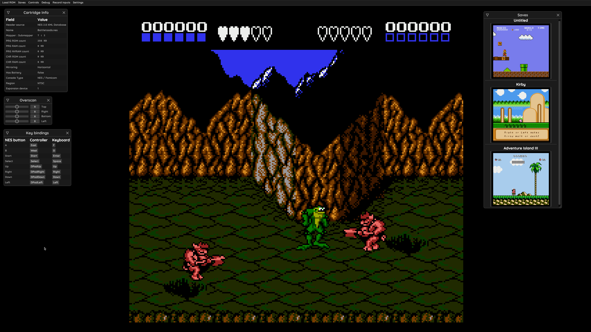
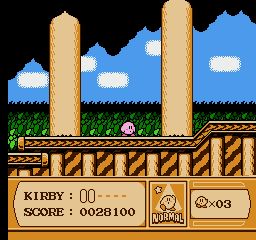
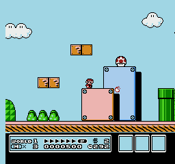
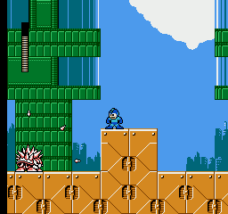
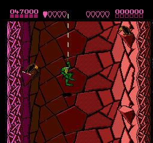
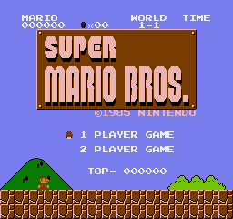

# Fearless-NES
Fearless-NES is a work-in-progress Nintendo entertainment system emulator written in Rust.

# Screenshots

# Features
- Cycle-accurate CPU emulation
- Very accurate PPU emulation
- Good APU emulation
- Basic mapper support
- Basic GUI
- Save states
- Gamepad support
- Controllable overscan
- Game loading using the NES 2.0 XML Game Database
- Custom key bindings and mouse cursor auto-hide

# Build instructions:
1. Build with `cargo run --profile=release-lto` and enjoy !

# Accuracy
For accuracy tests, see TESTS.md.
Run these with 'cargo test'.

# Supported mappers
| Mapper | Example Games |
| -------| ------------- |
| 0 (NROM) | Super Mario Bros, Donkey Kong, Balloon fight |
| 1 (MMC1) | Final Fantasy, Legend of Zelda, Mega Man 2 |
| 2 (UxROM) | Castlevania, Mega Man, Contra |
| 3 (CNROM) | Solomon's Key, Arkista's Ring |
| 4 (MMC3)* | Kirby's Adventure, Mega Man 3-6, Ninja Gaiden II: ... |
| 7 (AxROM) | Battletoads, Jeopardy! |

* Some MMC3 games like Mega Man III have major graphical issues, but SMB3 a Kirby's adventures do work.

With these mappers, Fearless-NES supports 84 % of commercial NES games.

# TODO
- [ ] (frontend) user-defined RGB palettes
- [ ] (frontend) NTSC filter

- [ ] (core) iNES 2.0 support
- [ ] (core) APU - low / high pass filters and better resampling to match typical sound card frequency
- [ ] (core) advanced mappers such as MMC5, VRC2/4...
- [ ] (core) various accuracy tests

- [ ] (dev) better (and more) integration tests

# Controls
### Keyboard
| NES controller | Keyboard |
| -------------- | -------- |
| A  | F  |
| B  | D  |
| Select  | Space |
| Start  | Enter  |
| Up  | ArrowUp  |
| Down  | ArrowDown  |
| Right  | ArrowRight  |
| Left  | ArrowLeft  |

### Gamepad

